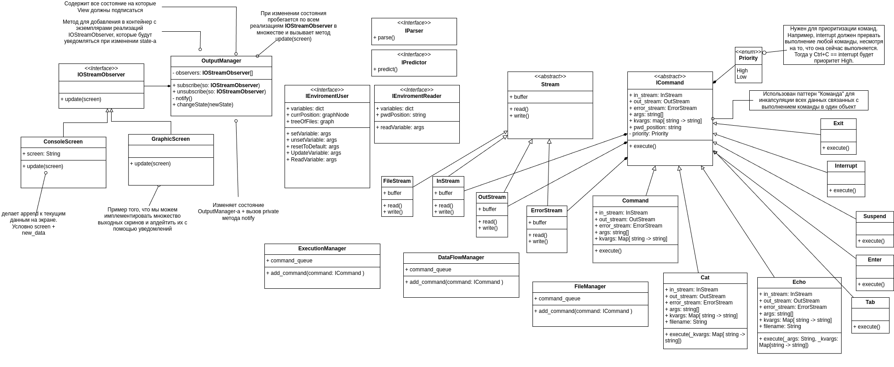

# Диаграмма классов для реализации Bash CLI

Данная диаграмма представляет дизайн на уровне классов.

## Обзор компонентов

### **Console View**
Console View отвечает за пользовательский интерфейс. Это основная точка взаимодействия пользователя с CLI. Состоит из следующих компонентов:

1. **ConsoleScreen**
   - Отвечает за отображение и хранение данных интерфейса.
   - Получает обновления от `OutputManager`.
   - Реализует паттерн Наблюдатель, где `ConsoleScreen` подписывается на обновления от `OutputManager`.
   - Добавляет новые данные к текущему содержимому экрана.

2. **GraphicScreen**
   - Графическая версия консольного экрана.
   - Также наблюдает за `OutputManager` для получения обновлений.
   - Позволяет реализовать несколько экранов вывода, обновляемых через уведомления.

---

### **Компоненты Presenter**

1. **OutputManager**
   - Управляет данными, которые выводятся на консоль через `ConsoleScreen` или `GraphicScreen`.
   - Получает результаты выполнения команд, форматирует их для отображения и передаёт на подписанные экраны.
   - Предоставляет методы подписки и отписки наблюдателей (`IOStreamObserver`).

2. **Input Controller**
   - Обрабатывает ввод пользователя, получаемый из `ConsoleInput`.
   - Передаёт команды в соответствующие компоненты Presenter или Model для выполнения.

3. **Control Signals**
   - Управляет специальными сигналами управления, такими как `Ctrl+C` или `Ctrl+Z`, для прерывания, приостановки или приоритизации задач.

4. **Command Builder**
   - Формирует команды из сырого пользовательского ввода.
   - Анализирует данные и передаёт структурированную команду в `ExecutionManager` для выполнения.

5. **Autocomplete Engine**
   - Предоставляет предложения автодополнения на основе пользовательского ввода и доступных команд.

6. **Lexical Analysis and Parser**
   - Выполняет лексический анализ пользовательского ввода.
   - Разбивает ввод на токены и распознаёт специальные символы, такие как кавычки, перенаправления и пайплайны.

---

### **Компоненты Model**

1. **ExecutionManager**
   - Отвечает за управление и выполнение команд.
   - Выполняет команды, сформированные `Command Builder`.
   - Контролирует приоритет выполнения (например, команды прерывания имеют высокий приоритет).

2. **DataFlowManager**
   - Управляет потоками данных между командами, включая перенаправление ввода-вывода.
   - Сохраняет промежуточные результаты выполнения команд.
   - Контролирует стандартные потоки для перенаправления данных.

3. **Environment**
   - Хранит текущее состояние окружения CLI, включая переменные окружения (например, `PATH`).
   - Позволяет изменять или создавать переменные окружения.

4. **Команды**
   - Используют паттерн Команда для инкапсуляции логики и данных выполнения.
   - Каждая команда (`Cat`, `Echo` и др.) наследуется от интерфейса `ICommand`.
   - Реализует свою логику через метод `execute()`.

5. **FileManager**
   - Управляет взаимодействием с файловой системой для выполнения команд, таких как `cat` или `wc`.
   - Обрабатывает перенаправления потоков ввода-вывода в файлы.

6. **Command History**
   - Хранит историю всех выполненных команд.
   - Используется для автодополнения и поиска команд.

---

### **Интерфейсы и абстрактные классы**

1. **IOStreamObserver**
   - Интерфейс для наблюдения за изменениями вывода.
   - Реализован в `ConsoleScreen` и `GraphicScreen`.

2. **Stream**
   - Абстрактный класс для работы с потоками данных.
   - Подклассы включают `InStream`, `OutStream` и `ErrorStream`.

3. **ICommand**
   - Интерфейс для всех команд.
   - Определяет структуру выполнения команд с параметрами, потоками и контекстом окружения.

4. **IParser**
   - Интерфейс для парсинга входных строк в команды или токены.

5. **IPredictor**
   - Интерфейс для предсказания пользовательского ввода (например, автодополнения).

6. **IEnvironmentUser и IEnvironmentReader**
   - Определяют методы для взаимодействия с окружением CLI.
   - Обеспечивают функции чтения, установки и изменения переменных окружения.

---

### **Приоритет команд**
- Перечисление `Priority` определяет два уровня: `High` и `Low`.
- Команды, такие как `Interrupt` (вызывается через `Ctrl+C`), имеют высокий приоритет для прерывания текущих операций.

---

## Используемые паттерны проектирования

1. **Паттерн Наблюдатель**
   - Реализован в `OutputManager` для уведомления `ConsoleScreen` и `GraphicScreen` об обновлениях.

2. **Паттерн Команда**
   - Инкапсулирует данные и логику выполнения в объекты команд (`Cat`, `Echo` и т.д.).

3. **Singleton**
   - Предположительно используется в `ExecutionManager` и `DataFlowManager` для централизованного управления.

4. **Builder Pattern**
   - Применяется в `Command Builder` для создания команд из ввода пользователя.
