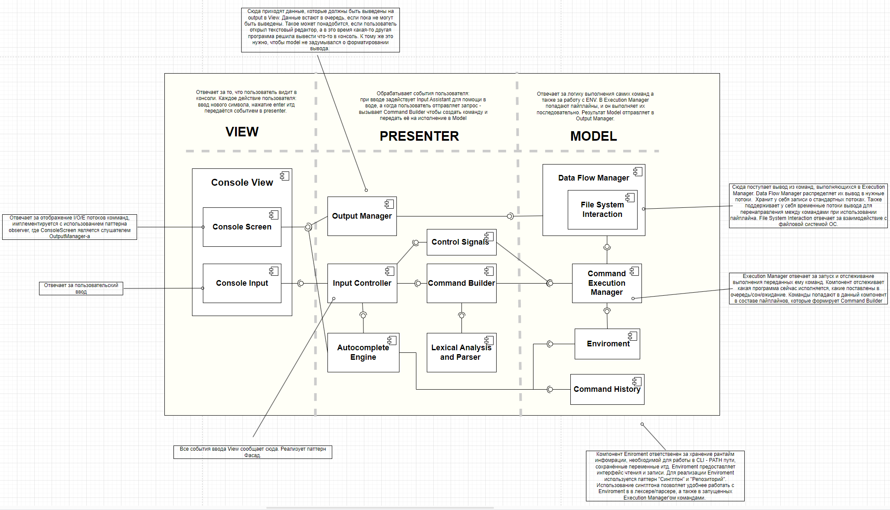

### View

1. **Console View**  
   Отвечает за UI. Это основной интерфейс для взаимодействия пользователя с CLI. Он реализован через компоненты `Console Screen` и `Console Input`, которые в свою очередь разделяют ответственность за отображение вывода и прием пользовательского ввода. Для взаимодействия с логикой приложения, использует Presenter. 
   
2. **Console Screen**  
   Представляет собой компонент, который отвечает за отображение и хранение данных UI. Обновления поступают из `Output Manager`. Реализует паттерн наблюдателя (observer), в котором `Console Screen` подписывается на обновления от `Output Manager`.

3. **Console Input**  
   Компонент, ответственный за обработку пользовательского ввода. Содержит в себе биндинг пользовательских действий на доступные вызовы Presenter'а. Любые действия пользователя в консоли (ввод текста, нажатие клавиш tab, enter и т.д) передаются в `Presenter` через этот компонент.

### Presenter
1. **Output Manager**  
   Обрабатывает данные, которые должны быть выведены в консоль через `ConsoleScreen`. Получает результат выполнения команд из `Model`, форматирует его для отображения и отправляет его в `ConsoleScreen` для отображения пользователю.

2. **Input Controller**  
   Управляет всем, что касается ввода данных от пользователя. Он соединяется с `Console Input`, обрабатывает события ввода и передает команды в другие компоненты `Presenter` для дальнейшего выполнения.

3. **Control Signals**  
   Компонент, который управляет сигналами управления для выполнения команд: `ctrl+c`, `ctrl+z` и т.д.

4. **Command Builder**  
   Этот компонент принимает сырые данные от пользователя через `Input Controller`, анализирует их и строит команду, которая затем передаётся в `Command Executer`. После завершения формирования команды передает ее на выполнение в `Model`.

5. **Autocomplete Engine**  
   Отвечает за автодополнение пользовательских команд. Когда пользователь начинает вводить команду, этот компонент предлагает возможные варианты. 

6. **Lexical Analysis and Parser**  
   Выполняет лексический анализ вводимой пользователем строки, разбивая её на токены для последующего анализа. Этот компонент отвечает за распознавание ключевых символов, таких как кавычки, операторы перенаправления и пайплайнов.

### Model
1. **Data Flow Manager**  
   Управляет передачей данных между различными командами. Отвечает за редирект потоков ввода-вывода и временное хранение промежуточных результатов исполнения команд. Также сохраняет стандартные потоки для обработки перенаправления данных.

2. **File System Interaction**  
   Отвечает за взаимодействие с файловой системой операционной системы. Он используется для выполнения команд, связанных с файлами и папками, таких как `cat`, `wc`, или перенаправление потоков ввода/вывода в файлы.

3. **Command Execution Manager**  
   Главный компонент для выполнения команд. Отвечает за запуск команд, проверку их выполнения, а также за контроль над пайплайнами.

4. **Environment**  
   Хранит текущее состояние окружения командной строки, включая переменные окружения, такие как `PATH`. Отвечает за создание новых переменных и управление текущими. Этот компонент используется, когда пользователь вводит команды вида `name=value` для изменения или создания новых переменных.

5. **Command History**  
   Хранит историю всех команд, введённых пользователем. Этот компонент используется как для предоставления автодополнений.